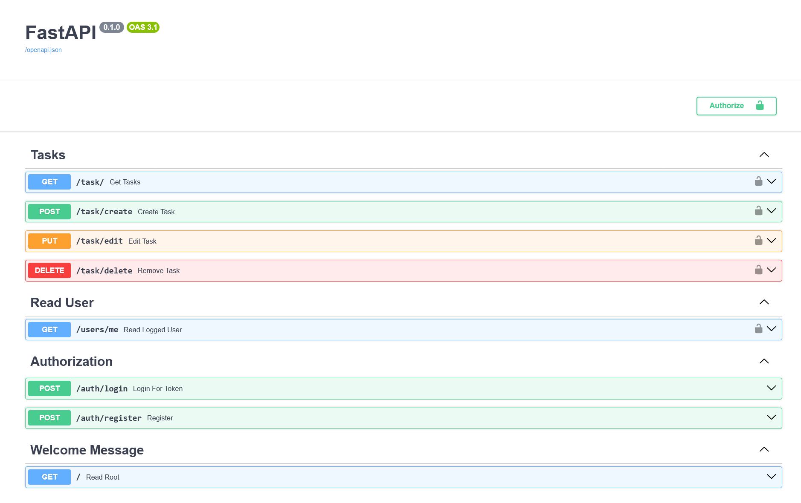

# Tasknado

Welcome to Tasknado! A NoSQL, RESTfull API app that allows users to register, log in, and manage their todo tasks.



### Features

- A welcome message inside a root endpoint
- New users can **create an account** with a username, email and password
- Registered users can **log in** and **recieve an authentication token**
- Logged-in users can **view** all their tasks
- Users can create and **add** new tasks to their to-do list
- Users can **update** the details of their existing tasks
- Users can **remove** tasks from their to-do list
- All task-related operations are secured and accessible only to authenticated users.

### Stack:

- Python
- FastAPI
- MongoDB 
- JWT (JSON Web Tokens)
- Pydantic
- Uvicorn
- Docker

### Installation

Before you install and run this Dockerized project locally:

- Ensure you have Docker installed on your machine
- Set up your own MongoDB Cluster and get your connection string. For future reference, let's call ours `super_secret_uri`

1. Clone this repo
2. In root directory, build a Docker image:
```
docker build -t tasknado_img .
```
3. Run the Docker container:
```
docker run -d -e MONGO_URI="super_secret_uri" -p 8002:8080 --name tasknado_container tasknado_img
```
4. Done!

To view this project visit: [Root endpoint](http://localhost:8002/) or [Swagger UI Documentation](http://localhost:8002/docs)

#### Additionally, you can:

- Stop running a container:
```
docker stop tasknado_container
```
- Remove created by us container:
```
docker rm tasknado_container
```
- Remove created by us image:
```
docker rmi tasknado_img
```
